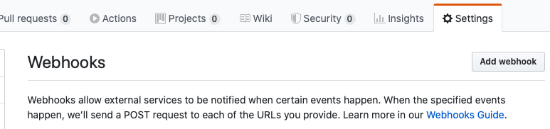

# Malandroid Bot

A custom made bot for Slack that notifies on a Slack channel when a Pull Request or a Comment in a Pull Request Review is made.

The message sent to Slack comes with the `@here`  tag and forces the notification to show. 

Malandroid Bot runs on .NET Core@Azure Functions because IoT with Adafruit.IO is also present on the project (Malandroid Bot is the software brother of [PRInformer](https://github.com/malainp/PRInformer) 🤖) and because why not?

## What you will need

1. Visual Studio or Visual Studio Code (for VS Code install .NET Core and Azure Functions extension for VS Code)
2. An Azure account (Microsoft Azure offers some free credit to test their platform, also they offer 12 months of some popular services so you're good to go with it and do some testing)
3. A Slack Webhook to send the messages
4. Github privilegies to add Webhooks to a repo (or contact with someone who has the proper access to do that)

---

## Before building or publishing

1. Populate the `SLACK_HOOK_URL` on `Consts.cs`  with your Slack incoming webhook (Check [this link](https://api.slack.com/messaging/webhooks) to know how to add one).
2. If you are not planning to use the [PRInformer](https://github.com/malainp/PRInformer) (😞) remove the `SendAdafruitData` call on the file `OnPullRequest.cs` or you may have some issues while executing your Function.
3. In case you also want to use [PRInformer](https://github.com/malainp/PRInformer) follow the instructions on the PRInformer README and copy the Adafruit Feed id and paste it on the placeholder `FEED_ID` string at the method annotation on `AdafruitService.cs`. Again, if you forgot to replace it you may have runtime issues. 

## Activating needed Github Webhooks

Publish your app on Azure Functions. when done go to the azure console and grab the functions URLs (each function have different URL) 

Go to your Repo settings and enter to **Webhooks** section then click the **Add webhook** button on the top right. (You may be prompted to enter your Github password)

On the **Payload URL** field put one of your functions URL (remember which one it was), change the **Content-Type** and click on **Let me select individual events**, then check only **Pull requests** if you added the **OnPullRequest** URL or **Pull request review comments** if you added the **OnPullRequestComment** on the payload url field. 

Press the **Add webhook** and repeat the steps for the other function.
